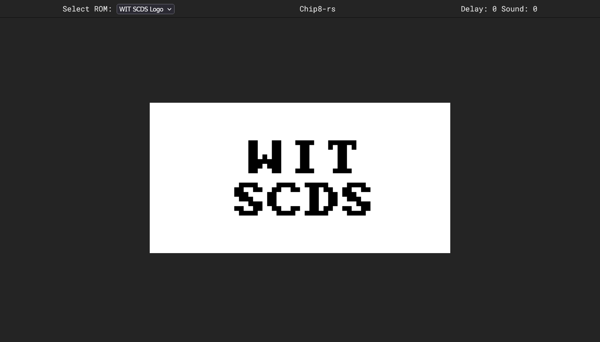

# chip8-rs

A CHIP-8 emulator written in Rust and Svelte.



- [chip8-rs](#chip8-rs)
  - [About](#about)
  - [Features](#features)
  - [Requirements](#requirements)
  - [Usage](#usage)
    - [Keyboard Mappings](#keyboard-mappings)
  - [Deploying](#deploying)
  - [License](#license)


## About

CHIP-8 is an interpreted programming language that was used to create games for 8-bit microcomputers in the 1970s and 1980s. This project is a Rust and WebAssembly implementation of a CHIP-8 emulator that can run these games on modern web browsers.

## Features

- Supports all 35 opcodes of the original CHIP-8 specification
- Implements a simple graphical user interface using JavaScript and HTML5 canvas
- Allows keyboard input to emulate the 16-key hexadecimal keypad
- Provides sound effects using the Web Audio API

## Requirements
- [Rust](https://www.rust-lang.org/)
- [wasm-pack](https://rustwasm.github.io/wasm-pack/)
- [node.js](https://nodejs.org/en)

## Usage
To run the emulator, simply go to https://chaoticwyrme.github.io/chip8-rs/ where it is deployed on GitHub Pages.

To build the project, you need to have [Rust](https://www.rust-lang.org/learn/get-started), [wasm-pack](https://rustwasm.github.io/wasm-pack/installer/), and [NodeJS](https://nodejs.org/en) installed on your system. Then, clone this repository and enter the chip8_web directory. Run `npm run wasm` to build chip8_core into wasm. Next, use `npm install` to install the node dependencies.
Finally, you can start the dev server with `npm run dev` to start a local web server that hosts the emulator and updates the interface as you make changes. You can then open `http://localhost:5173` in your browser to use the emulator.

```bash
git clone https://github.com/chaoticwyrme/chip8-rs.git
cd chip8-rs
cd chip8_web
npm run wasm
npm install
npm run dev
```

### Keyboard Mappings
You can use the following keyboard mappings to control the game:

| Original | Emulator |
| -------- | -------- |
| 1 2 3 C  | 1 2 3 4  |
| 4 5 6 D  | Q W E R  |
| 7 8 9 E  | A S D F  |
| A 0 B F  | Z X C V  |

You can also use the following keys to interact with the emulator:

| Key   | Action               |
| ----- | -------------------- |
| P     | Pause/resume         |
| M     | Mute/unmute          |
| Space | Step through opcodes |
| Esc   | Quit                 |

## Deploying
There is a [Action script](./.github/workflows/deploy.yml) for building and deploying the code.
Basically the steps are:
1. Install dependencies
2. `npm ci` in `chip8_web` to install JS dependencies
3. `wasm-pack build --target web --release` in `chip8_wasm` to build rust into wasm for release
4. `npm run build` in `chip8_web` to build web interface and copy over wasm files
5. Zip and upload `chip8_web/deploy` as an artifact.
6. Publish to github pages

By default, deploying is triggered by pushing to the `deploy` branch, but it can also be triggered manually on any protected branch.

## License
This project is licensed under the MIT License - see the LICENSE file for details.

